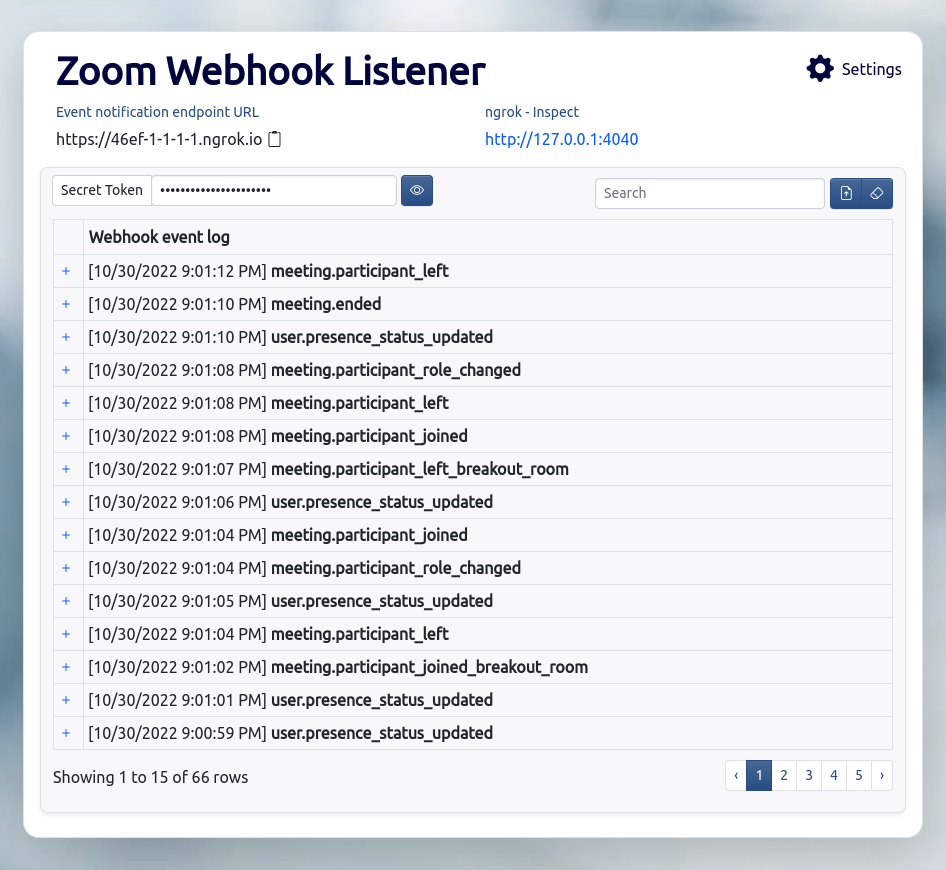

# Zoom Webhook Listener

> **Note**
> 
> The following sample application is a personal, open-source project shared by the app creator and not an officially supported Zoom Video Communications, Inc. sample application. Zoom Video Communications, Inc., its employees and affiliates are not responsible for the use and maintenance of this application. Please use this sample application for inspiration, exploration and experimentation at your own risk and enjoyment. You may reach out to the app creator and broader Zoom Developer community on https://devforum.zoom.us/ for technical discussion and assistance, but understand there is no service level agreement support for this application. Thank you and happy coding!


This example app uses Node.js + Express to create a Zoom webhook event listener and forwarder.

# Features

- ngrok is included with ability to add authtoken.
- Can act as middleware to handle validation requests.
- Docker support
- Supports Zoom CRC check for Webhook URL validation. See this [page](https://marketplace.zoom.us/docs/api-reference/webhook-reference/#validate-your-webhook-endpoint) for details.
- Supports Zoom x-zm-signature header for Webhook event verification. See this [page](https://marketplace.zoom.us/docs/api-reference/webhook-reference/#verify-webhook-events) for details.

## Prerequisites

1. [Docker](https://www.docker.com/)
2. [Zoom Account](https://support.zoom.us/hc/en-us/articles/207278726-Plan-Types-)

## Getting Started

```bash
# Clone this repository
git clone https://github.com/Will4950/zoom-webhook-listener.git

# Navigate into the cloned project directory
cd zoom-webhook-listener

# Build docker images
docker-compose build

# Start the container
docker-compose up
```

## Usage

- Open a browser and navigate to http://localhost:8585
  > This app is only accessible from a private network. You cannot access the app using the ngrok URL.

# Development

## Prerequisites

1. [Node.js LTS](https://nodejs.org/en/)
2. [Zoom Account](https://support.zoom.us/hc/en-us/articles/207278726-Plan-Types-)

## Getting Started for Developers

```bash
# Clone this repository
git clone https://github.com/Will4950/zoom-webhook-listener.git

# Navigate into the cloned project directory
cd zoom-webhook-listener

# run NPM to install the app dependencies
npm install

# start the app in development mode
npm start
```
